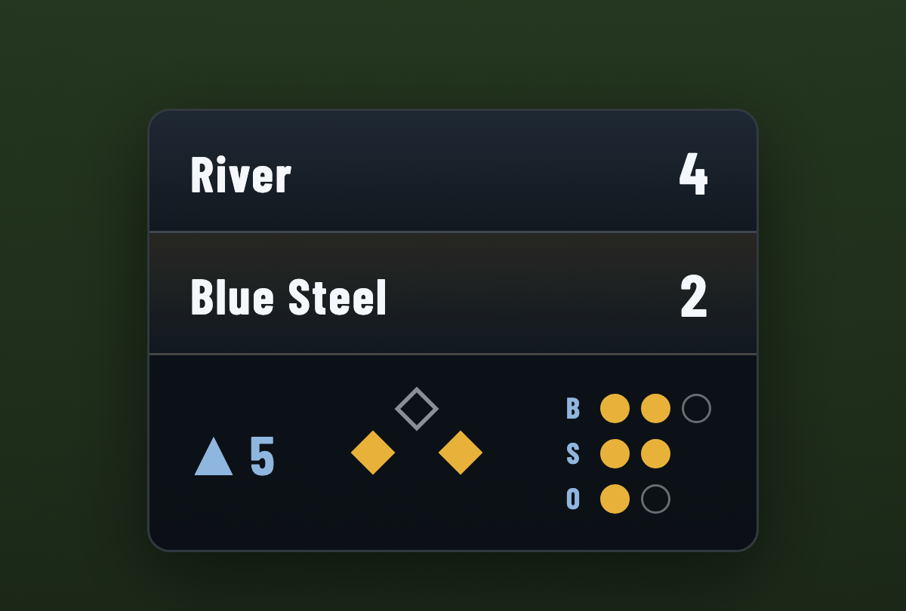
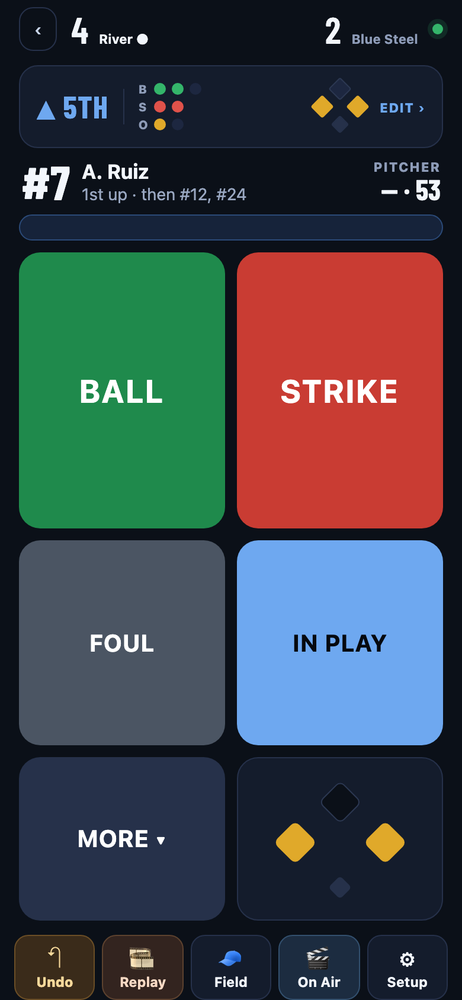
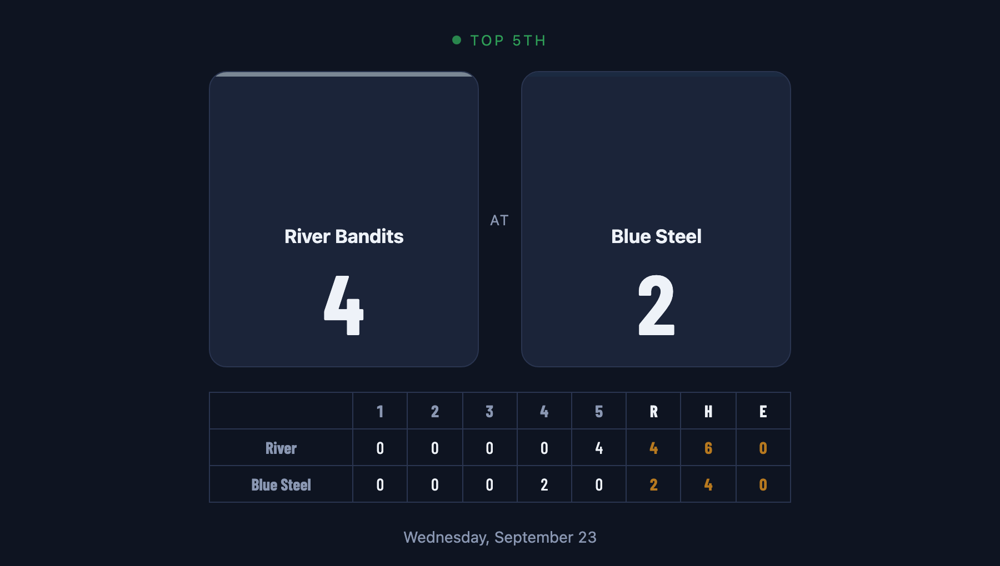

# Broadcast Scoreboard

[](https://github.com/Sawdizzle/scoreboard/actions/workflows/check.yml) [](LICENSE)

A phone-controlled scoreboard overlay for live-streamed youth sports. You score the game on your phone at `/control`; OBS shows the scorebug, cards and animations from `/overlay`, a transparent 1920×1080 Browser Source. Baseball has the deepest pad; football, soccer, volleyball and basketball work too. It is two static pages (plus a public recap page) on Supabase (Postgres, Realtime, Auth) with no build step. Updates reach the overlay in about a quarter of a second, and the overlay keeps its last state through network drops instead of going blank.

<table>
<tr>
<td width="55%" align="center"><br /><sub><b>The overlay</b> — a transparent Browser Source in OBS, shown here over a plain green plate</sub></td>
<td width="45%" align="center"><br /><sub><b>The pad</b> — what you actually hold during the game</sub></td>
</tr>
</table>

## Get your own

Scoreboard runs on a free Supabase project and any static host. Setup takes about 20 minutes if you have used Supabase before.

[](https://vercel.com/new/clone?repository-url=https%3A%2F%2Fgithub.com%2FSawdizzle%2Fscoreboard&project-name=scoreboard&repository-name=scoreboard)

That button copies this repo into your own GitHub account and puts it on your own Vercel project. The site will load, but it will talk to nothing until you do steps 1-5 below and edit `js/config.js` in **your** copy — there is no build step, so the keys are committed rather than injected as environment variables. Hosting elsewhere is fine too; it is a folder of static files.

1. Create a Supabase project, and give this app one of its own. The publishable key ships in `js/config.js`, so whoever reads your repo can talk to that project as `anon`. RLS keeps them out of Scoreboard's data, but any *other* app sharing the project is exposed to the same key — an anon-writable table belonging to something else becomes a spam target. One project, one app.
2. Project Settings → API (Data API): add **`scoreboard`** to the exposed schemas.
3. Apply `supabase/migrations/*.sql` in filename order: the baseline first, then each change. `supabase/migrations/README.md` covers the CLI route and the state of the baseline. `supabase/pending/` holds changes written but not yet applied; each says when it may run.
4. Deploy the signup function with JWT verification off (new users have no JWT; it uses the injected service role, so no secret is set by hand): `supabase functions deploy signup --no-verify-jwt`.
5. Put your project URL and publishable key in `js/config.js`, and the same project URL in the three `<link rel="preconnect">` lines in `control.html`, `overlay.html` and `recap.html` (`node scripts/check.mjs` fails until they match). The publishable key is safe in client code; RLS protects the data, and `service_role` is granted nothing in the `scoreboard` schema, so even that key cannot read a roster through the API. If you change `USER_EMAIL_DOMAIN` there, change `EMAIL_DOMAIN` in `supabase/functions/signup/index.ts` to match.
6. Deploy the repo root as a static site. On Vercel: framework preset **Other**, no build command, root as output. `vercel.json` turns on clean URLs (`/control`, `/overlay`, `/recap`).
7. Optional: the lobby's footer carries the original author's Buy Me a Coffee button (`control.html`, `<footer class="support">`). Change it to yours or delete it.

Anyone who can reach your site can create an account; the signup function allows five attempts per address per hour. Since `js/config.js` is committed, anyone reading your repo can reach that endpoint — so if the site is only for your team, set an invite code and hand it out:

```
supabase secrets set SIGNUP_INVITE=your-code
```

The pad's **Invite code** field is optional and ignored while the secret is unset, which is the right default for one team on its own project. A wrong code counts against the five-per-hour throttle, so a short code stays worth using.

**Local development**: serve the folder over HTTP (ES modules do not load from `file://`), and use the `.html` paths (`/control.html`, `/overlay.html?ch=…`) unless your server does clean URLs. Use a threaded server — `python3 -c "from http.server import SimpleHTTPRequestHandler, ThreadingHTTPServer; ThreadingHTTPServer(('127.0.0.1', 5173), SimpleHTTPRequestHandler).serve_forever()"` — because `python3 -m http.server` handles one request at a time and a browser asking for every stylesheet, font and module at once can get served a page with no CSS at all. Local pages talk to whatever Supabase project `js/config.js` names, so if that is the project your games run on, test with a throwaway game. The overlay is a 1920×1080 canvas; maximise the window. Browsers block audio until one click on the overlay; OBS does not.

## If something is not working

**"This scoreboard is invite-only" on a copy you just deployed.** Your copy is still talking to somebody else's Supabase project. `js/config.js` is committed, so a fresh clone carries the original author's project URL and key until you change them — and that project does not know you. Do steps 1-5 above, put your own URL and publishable key in `js/config.js`, and run `node scripts/check.mjs`, which fails until the three `preconnect` lines agree with it. Signup on your own project is open unless you set an invite code yourself.

**The pad loads but the game list is empty and nothing saves.** Same cause, or the `scoreboard` schema is not exposed. Project Settings → API (Data API) → Exposed schemas must list `scoreboard`. A request to a schema that is not exposed comes back `406`.

**"Could not create account" or a network error on signup.** The signup function is not deployed, or was deployed with JWT verification on. A new user has no JWT to verify, so it has to be `supabase functions deploy signup --no-verify-jwt`. Five sign-ups per address per hour also return an error; that one clears by itself.

**The overlay is a blank browser source.** Check the URL. `/overlay?ch=…` needs clean URLs, which `vercel.json` turns on; a plain static server wants `/overlay.html?ch=…` instead. If the page loads but stays empty, the game is in setup and has nothing to show yet — open it on the pad.

**The overlay shows a different game than the one you are scoring.** The overlay link belongs to your account, not to a game, and follows whichever game you last opened. Open tonight's game on the pad, or use **Show this game on the overlay** on the Overlay link screen.

**Serving it locally renders a page with no styling.** `python3 -m http.server` handles one request at a time, and a browser asking for every stylesheet, font and module at once can be served an unstyled page. Use a threaded server: `python3 -c "from http.server import SimpleHTTPRequestHandler, ThreadingHTTPServer; ThreadingHTTPServer(('127.0.0.1', 5173), SimpleHTTPRequestHandler).serve_forever()"`.

**Sound never plays in a browser tab.** Browsers block audio until the page is clicked once. OBS does not, so this only affects previewing in a normal tab.

## Your first game

Open `/control` on your site. On a phone, Safari → Share → **Add to Home Screen** runs it full-screen.

1. **Create an account**: a username and a 6–8 digit PIN. There is no email step.
2. **+ New Game**: pick the sport and both teams. A saved team loads with its lineup and positions, and a team marked **★ My team** (Setup → Teams) is preselected on the side it last played. A new team only needs a name; Create opens the jersey keypad for it. Look, sound, sponsors and the Show-on-overlay switches copy from your last game.
3. Work through the checklist at the top of the game: teams, lineups, positions (including the pitcher), overlay link.
4. **⚙ Setup → Overlay link → Copy**, and paste it into OBS as a Browser source (next section). You do this once.
5. Score from the pad. It keeps the phone's screen awake while a game is open.

**The overlay link belongs to your account, not to a game.** It looks like `/overlay?ch=<token>` and shows whichever game you last opened on the pad, so it never needs re-pasting. Opening a game that is already Final does not move it, so checking last week's result does not take tonight's game off the air. If the link is showing a different game, the Overlay link screen has **📺 Show this game on the overlay**. Old per-game links (`/overlay?game=<id>&t=<token>`) still work.

**Treat the overlay link like a password**: its token can read your lineups. **🔑 Rotate link** on the same screen kills every old link of both kinds, and you paste the new one into OBS. The **recap link** (`/recap?game=<id>`) is safe to share with parents: score, line score and a play-by-play, never lineups or names.

<p align="center"><br /><sub>The recap link parents get: score and line score, never lineups or names</sub></p>

To practise, **▶ Demo Mode** on the Overlay link screen plays a fake game in a new practice game, so your real one stays clean (the overlay link follows the practice game while it runs). **Preview All FX** next to it fires every animation.

## OBS setup

1. **Sources → + → Browser**, name it "Scorebug".
2. **URL**: the overlay link. **Width 1920, Height 1080, FPS 30.** Leave Custom CSS alone; the page is already transparent.
3. **Uncheck "Shutdown source when not visible"** so the Realtime connection stays up between scenes.
4. **Check "Control audio via OBS"** so the overlay's sounds reach the stream. Set Audio Monitoring to "Monitor and Output" if you also want them in your headphones.
5. **Page permissions** decide how much of OBS the pad may drive. A feature above your level shows as muted on the pad with the setting to raise; it is never a warning.

   | Page permissions | Unlocks |
   | --- | --- |
   | No access (default) | Everything on the overlay: scorebug, cards, animations, sound |
   | Basic | + 🎞️ Replay clips and auto-clip |
   | Advanced | + 🎥 Cameras (scene switching), starting/stopping the replay buffer |
   | Full | + Go live and Record |

6. Place and size the bug from **Setup → Look & sound** (3×3 position grid and scale), not by resizing the source.

**Cameras**: one scene per camera. Add the scorebug to each with **+ → Browser → "Add Existing"**, choosing the same Scorebug source. Never make a second browser source: two copies mean doubled sound and two clips per replay. If you deliberately want an extra copy, add `&obs=0` to its URL so it stays out of OBS control. 🎥 Cameras appears on the pad once OBS reports its scenes, and the pad follows cuts made at the OBS machine.

**Replay buffer**: Settings → Output → enable the Replay Buffer at **90 seconds**; Settings → General → start it automatically when streaming. **🎞️ Replay** on the pad saves a clip immediately. **Auto-clip big plays** (Setup → OBS) waits for the celebration and then saves (up to 60 s after a walk-off), which is why the buffer needs 90 s. The pad reports when the buffer is not running, before first pitch.

**Recommended output** for a laptop at the field:

| Setting | Value |
| --- | --- |
| Video base and output | 1920×1080, 30 FPS |
| Stream encoder | Hardware (Apple VT or NVENC), CBR 6000 kbps, keyframe interval 2 s |
| Recording | Encoder "Same as stream" (otherwise the game is encoded twice), format Hybrid MP4 or MKV |

Each extra camera costs more than everything else combined, because a capture device decodes continuously whether or not it is on air. After that: a software encoder, a separate recording encoder, and 60 FPS anywhere. If a laptop struggles, "Deactivate when not showing" on the capture devices helps at the cost of a beat on each cut. OBS's Stats dock shows whether frames are lost to rendering or encoding.

No OBS? Turn off **Show OBS buttons on this device** in Setup → OBS. The overlay is a plain web page and works as a browser source in any streaming software.

## Scoring (baseball)

- **BALL / STRIKE / FOUL** for pitches. Ball four records the walk and pushes the forced runners in one tap; the toast's **Fix runners** opens the Situation screen for the rare extra base. Strike three asks **Swinging**, **Looking** or **Dropped 3rd** (greyed out, with the reason, when the batter cannot run).
- **IN PLAY** → the result (hit, reached, error, fielder's choice, or the kind of out) → the fielder → where the runners ended up, pre-filled with the likely result. The runner step is skipped when the bases are empty.
- **Tap a runner** on the pad's diamond for stole, caught stealing, picked off, to next on WP/PB, or batter's interference. The count and the batter stay.
- **MORE**: hit by pitch, catcher's interference, intentional walk, balk.
- **↶ Undo** reverses the last play, and again for the one before.
- **The count bar** opens the Situation screen: every correction (bases, count, outs, inning, previous/next batter, pitch count, R/H/E — a run fixed here also goes in the line score), and **🏁 End game**.
- **The batter line** opens the Lineup. **🧢 Field** on the bottom bar sets positions by jersey number: tap a spot, tap the number. A pitching change gives the new pitcher his own pitch count.
- The third out ends the half and raises **Mid-Inning** on its own; the next half's first pitch takes it down. **End game** raises the **Final screen**.
- Runs, strikeouts, walks, hits and outs fire their own animation and sound.

The other sports use simple button grids. Corrections and End game for each are in the Situation screen, opened from the bar under the score.

- **Football**: possession, down and distance, TD / FG / XP / 2-PT / Safety (credited to the team with the ball), next quarter, game clock.
- **Soccer**: goals, halves, stoppage time, yellow and red cards, a count-up match clock using the game's period length.
- **Volleyball**: rally points, serve, Ace, End set; sets to 25/21/15 won at the target with a 2-point lead.
- **Basketball**: +1/+2/+3, team fouls with bonus indicators, next period, game clock.

## On Air

**🎬 On Air** on the bottom bar holds everything you put on the stream. Tap to raise, tap again to take down; a card that is up shows as a chip in the game header, and its ✕ takes it down.

- **Cards**: Batting order, Defense (baseball), Matchup, Sponsor. Optional card text sets a subtitle on the next card you raise.
- **Full screen** (hides the scorebug; the camera keeps running behind): **Starting Soon** (countdown to the start time; every new game opens with it up, and the game going live takes it down), **Mid-Inning**, **Final screen**.
- **Delays & announcements**: the **Game paused** card (lightning, rain, weather, suspended, called) with an editable countdown and storm effects, and the **announcement ticker** that scrolls along the bottom of every scene until taken down.
- **Moments**: Walk-Off, 🎺 Charge!, Rally (a glow until turned off). Everything else fires on its own.

## Setup screen

- **Overlay link**: copy, open, Show this game on the overlay, Rotate link; the recap link; Demo Mode and Preview All FX.
- **Teams**: names, abbreviations, colours, logos and rosters; swap home and away. A named team with a lineup saves itself as you edit (keyed by name), so next game it is one pick. **★ My team** marks your own: preselected in New Game, and the setup checklist asks for its positions only; an opponent's are optional.
- **Lineup**: rows of number, name and position; **⌨ Jersey numbers** for entering a lineup card at game time (tap a number, Next, repeat; ⌫ on an empty keypad takes the last one back), and **📋 Paste a list** for one player per line (`7 Ava Reyes SS`, `#12 Ben Ortiz (P)`, `3 Cy`).
- **Lineups & positions**: the same screens the batter line and 🧢 Field open.
- **Sport**: which sport the pad and overlay run.
- **Times & rules**: start time (sorts the games list, drives the Starting Soon countdown), venue (local weather on Starting Soon and the Game paused card), time limit, regulation innings (arms the automatic walk-off).
- **Show on overlay**: clock, batter, pitcher, pitch count, R-H-E on the bug, run-rule watch.
- **Look & sound**: the scorebug design, the theme, the 3×3 position grid, scale, five sound packs, one volume, mute. A design is one of five layouts (Scorebox, Bar, Bug, Minimal, Lower-third), painted by one of 16 themes (including Blue Steel) or Custom colours. Baseball games can instead pick one of seven **animated** scorebugs (Classic Green, Backglass, Chalk Talk, Ka-Pow, Departures, Play-by-Play Printer, Battle Mode), which bring their own look and play their own home run, strikeout and hit moments; the theme then colours only the cards and the ticker. See them all at `/bugs`.
- **Sponsors**: a list of names and logos, shown as a rotating "brought to you by" corner bug that hides while a full-screen card is up.
- **OBS**: the OBS-buttons switch, current page-permission level, auto-clip, Go Live / Record / Buffer.
- **This game**: Reset to 0–0 (keeps teams and look) and Delete (cannot be undone).

## Development

- `node scripts/check.mjs`: wiring checks. Syntax on every module, every element id a script looks up against its page's markup, handlers that must stay wired, calls to functions defined nowhere, pad modules using a control.js name they were not handed, a screen constructed before the screen it borrows a helper from, and preconnect hints that disagree with `js/config.js`.
- `node --test scripts/*.test.mjs`: the rules (all five sports), the event-log replay, the write queue, and the recap. No dependencies.

Both run on push and on every pull request via `.github/workflows/check.yml`.

There is no build step, so nothing compiles these files before a browser does. That makes load-time errors the dangerous class: `control.js` is one module, and anything thrown while it runs leaves a blank page rather than a broken button. The load-order check exists because that shipped once. Each screen is built by a `create*()` call that is handed a bag of helpers, and a bare name in that bag is read the moment the line runs, so it has to come from a line above it. Wrap it in an arrow (`game: () => game`) when it should be read later instead.

| File | What it is |
| --- | --- |
| `js/control.js` | The pad: auth, the open game, baseball scoring, sheets, the Lineup screen |
| `js/lobby.js` | The games list and New Game (what a new game carries over) |
| `js/setup.js` | The Setup screen: panes, summary rows, fields that write as you edit |
| `js/field.js` | The Field screen: positions by jersey number, pitching changes |
| `js/pads.js` | The other four sports' pads: buttons, Situation rows, demo, stingers — one table |
| `js/obs-pad.js` | OBS from the pad: permission tiers, stream/record/buffer, scene cuts, replay clips |
| `js/overlay.js` | The OBS page: render, Realtime, roster pull, OBS relay |
| `js/recap.js` | The public recap page |
| `js/logic.js` | Baseball rules as pure functions, plus the event-log replay |
| `js/roster.js` | A team's roster: players, ids, positions (re-exported by logic.js) |
| `js/football.js`, `js/soccer.js`, `js/volleyball.js`, `js/basketball.js` | Rules for the other sports |
| `js/sync.js` | The pad's write queue — plays, settings and lineups, in order, retried (no DOM, no Supabase; tested with injected I/O) |
| `js/clock.js` | Server-time offset shared by nonces and game clocks |
| `js/anim.js`, `js/audio.js` | Overlay animations and synthesized sound |
| `js/starting.js` | Starting Soon card markup |
| `js/weather.js`, `js/storm.js` | Venue forecast (Open-Meteo) and the Game paused storm effects |
| `js/supabase.js`, `js/config.js` | Client setup and project config; `js/vendor/` holds a pinned supabase-js |
| `css/control.css` | The pad |
| `css/overlay.css`, `css/styles.css`, `css/themes.css` | Scorebug base, the five layouts, the themes |
| `css/cards.css`, `css/anim.css` | Broadcast cards and animations |
| `css/recap.css`, `css/fonts.css` | Recap page; self-hosted Barlow Condensed |
| `fonts/bugs/` | The animated scorebugs' fonts, self-hosted (licenses in `LICENSES.md`) |
| `bugs/`, `js/anim-bug.js` | Animated scorebugs: one page per bug on a shared `bugs/kit.js`; the overlay loads the chosen one in a frame and feeds it the game |

Debugging: `/overlay?…&debug=1` paints a checkerboard behind the transparent overlay and exposes `__sb.render(patch)` to preview a what-if over the live row without writing it. `/control?debug` shows the badge that checks the game on screen against a rebuild from its own event log.

## How it works

- **`games` is public-read.** The overlay reads it anonymously over Realtime, and Realtime applies RLS as the subscriber, so the row cannot be locked down. Nothing private goes on it: team names, scores, look and settings only. Writes are owner-only.
- **Rosters are owner-only** in `scoreboard.rosters`. The overlay reads them through `get_roster(game, token)`, a `SECURITY DEFINER` function that checks the token carried in the overlay link. The account link resolves to a game and token through `resolve_channel`. `roster_rev` on `games` tells the overlay when to re-pull.
- **The token also gates the overlay's write-backs** (OBS status, camera list, clip acks), so a leaked recap link cannot spoof the pad's OBS panel.
- **Plays go through `apply_event`**, which writes the change and an event with a snapshot of the row before it. Undo is multi-level, survives reloads, and restores only the columns that play wrote. The log keeps the newest 200 events per game. The recap's play-by-play comes from a name-free `plays` table filled in the same transaction.
- **Settings are direct row writes** (teams, look, switches, cards) and are never undone.
- **Stingers ride `current_animation`** with a nonce, usually in the same write as the play. Nonces and game clocks use server time (`server_now()`), so a phone with a wrong clock still works.
- **The pad queues writes** in order and retries until the server accepts them, so scoring continues on flaky LTE. A header badge counts what is waiting, and leaving a game with unsent changes asks first. The queue is memory-only.
- **OBS control happens inside the browser source.** The pad cannot reach OBS, so it writes a command with a nonce to the games row (`replay_cmd`, `scene_cmd`, `obs_cmd`). The overlay sees it over Realtime, calls `window.obsstudio`, and reports status back through token-gated RPCs.
- **Accounts**: a username maps to an internal email and the PIN is the password. The `signup` function creates pre-confirmed accounts, requires 6–8 digit PINs (older 4-digit accounts still log in), and allows five attempts per address per hour.

## License

MIT, see [LICENSE](LICENSE). Bundled third-party code keeps its own license: supabase-js (MIT, header of `js/vendor/supabase-js-2.115.0.js`), and the fonts Barlow Condensed, Martian Mono and Anton (SIL Open Font License: `fonts/OFL.txt`, `fonts/OFL-MartianMono.txt`, `fonts/OFL-Anton.txt`).
